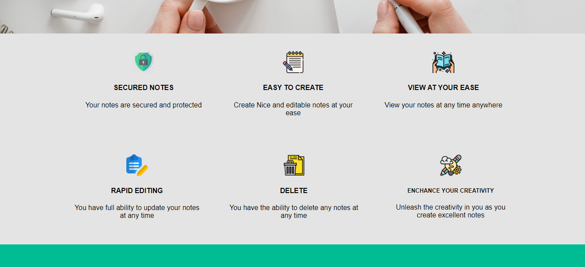
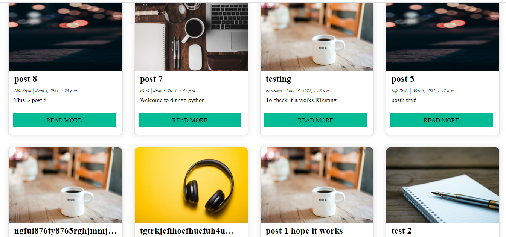

# django-notez

A  web based journal. Here demo [here](http://notez-1.herokuapp.com/)

# Description
This is a secured web based journal and diary suitable for storing text of any lenghth and accesible at any time.  

Use this details to check it out

Username: Test123

Password: Test@123

# Screenshot






# Technologies used
* Django
* HTML
* CSS 
* JavaScript
* Heroku  
* Amazon S3

# How to install 
Clone to local computer
```
git clone https://github.com/Tosin-dotcom/django-notez.git
```

Install all the requirement using the command 
```
pip install -r requirements.txt
```

Change use_s3 to False on line 141 in the notez/settings.py file

from `use_s3 = True` to `use_s3 to False`


Run using the following command
```
python manage.py runserver
```
